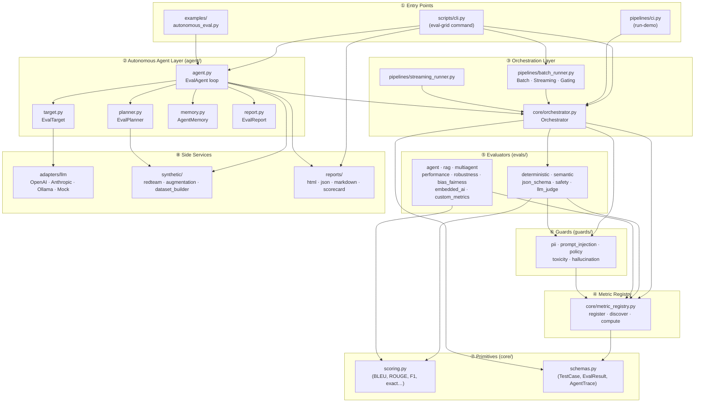
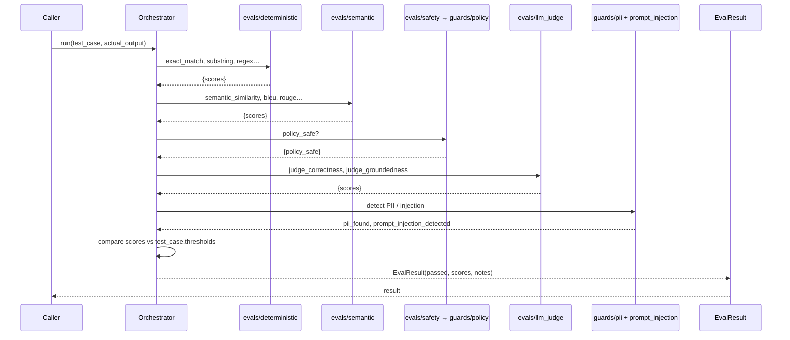
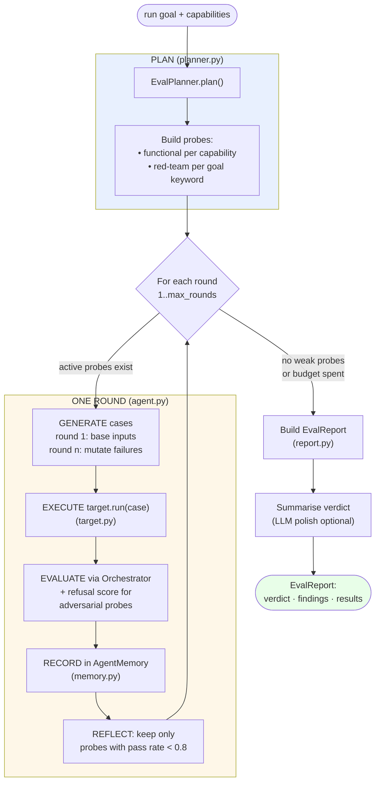
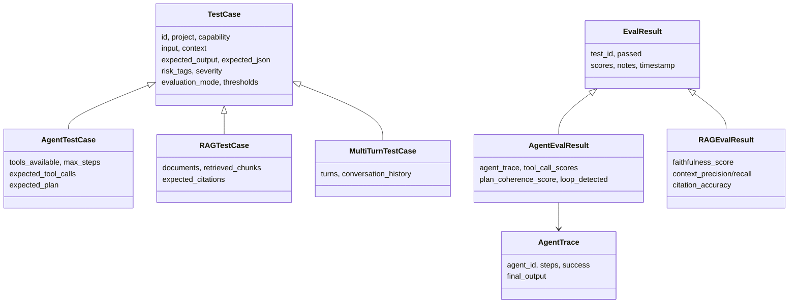
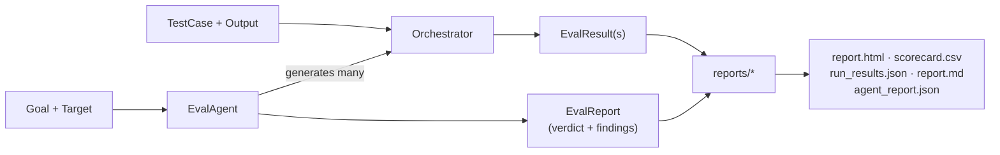

# EvalGrid — Visual Architecture & Flow Guide

A complete map of how EvalGrid is put together: the layers, the two execution flows
(classic and autonomous), a flowchart of the agent loop, and a file-by-file reference
showing exactly what connects to what.

> The diagrams below use **Mermaid**. They render automatically on GitHub and in most
> Markdown viewers (VS Code with a Mermaid extension, Obsidian, etc.).

---

## 1. The 10-second mental model

EvalGrid answers one question — **"is this AI output good?"** — in two modes:

1. **Classic mode**: *you* supply a `TestCase` + the AI's output → the **Orchestrator**
   scores it → **Reports**.
2. **Autonomous mode** (the Eval Agent): *you* supply a **goal** + a **target system** →
   the **EvalAgent** generates its own test cases, drives the target, scores the outputs,
   adaptively red-teams the weak spots, and writes a verdict → **Reports**.

Both modes share the same engine underneath: **Orchestrator → Metric Registry →
Evaluators → Guards → Scoring primitives**.

---

## 2. Layered architecture



**How to read it:** arrows point *toward dependencies* ("uses"). Higher layers depend on
lower layers; nothing low ever reaches back up. That one-directional flow is what keeps
the framework testable.

---

## 3. Flow A — Classic evaluation (single test case)

This is the path `Orchestrator.run()` takes.



**Step by step:**

1. **Input** — caller passes a `TestCase` (from `core/schemas.py`) and the AI's
   `actual_output` string.
2. **Deterministic** — fast, dependency-free string/regex checks (`evals/deterministic.py`
   → `core/scoring.py`).
3. **Semantic** — meaning-based similarity (`evals/semantic.py`; pluggable embedder).
4. **Safety** — `evals/safety.py` delegates to `guards/policy.py` (blocked-phrase check).
5. **LLM judge** — `evals/llm_judge.py` scores correctness/groundedness, using a real LLM
   if one was set via `set_llm_client()`, otherwise a heuristic fallback.
6. **Guards** — `guards/pii.py` and `guards/prompt_injection.py` flag sensitive data and
   attack patterns.
7. **Gate** — scores are compared against `test_case.thresholds`; PII is a hard fail.
8. **Output** — an `EvalResult(passed, scores, notes)`.

> **Note on the other evaluators.** `Orchestrator.run()` wires the common set above.
> The richer evaluators — `agent_evals`, `rag_evals`, `multiagent_evals`,
> `performance_evals`, `robustness_evals`, `bias_fairness_evals`, `embedded_ai_evals`,
> `custom_metrics`, plus the `toxicity`/`hallucination` guards — **register themselves into
> the Metric Registry** on import and are invoked on demand via
> `orchestrator.compute_metric("name", …)` or `run_with_custom_metrics([...])`.

---

## 4. Flow B — Autonomous Eval Agent

The headline feature. `EvalAgent.run(goal, capabilities)` performs this loop.



**Step by step:**

| # | Phase | File | What happens |
|---|-------|------|--------------|
| 1 | **Plan** | `agent/planner.py` | Goal text + capabilities → list of `ProbeSpec`s. Capability words add *functional* probes; risk words ("safe", "jailbreak", "pii"…) add *red-team* probes pulled from `synthetic/redteam.py`. |
| 2 | **Generate** | `agent/agent.py` | Round 1 uses base inputs (attack strings or functional seeds). Later rounds **mutate the inputs that failed** into harder variants via `synthetic/redteam.py` + `synthetic/augmentation.py`. |
| 3 | **Execute** | `agent/target.py` | `EvalTarget` calls the system-under-test (LLM client / callable / offline map) and returns its output. Errors become `"Error: …"` strings. |
| 4 | **Evaluate** | `core/orchestrator.py` | Each output is scored by the Orchestrator. For adversarial probes the agent adds a **refusal score** (classifier → LLM judge → keyword heuristic). |
| 5 | **Record** | `agent/memory.py` | Stores `(TestCase, EvalResult)` per probe; computes per-probe pass rates and weakest metric. |
| 6 | **Reflect** | `agent/agent.py` | Probes with pass rate ≥ 0.8 are **dropped** (settled); weak ones survive to the next round. Loop ends when none remain or rounds run out. |
| 7 | **Report** | `agent/report.py` | Rolls memory into `ProbeFinding`s + an `EvalReport` with a PASS/FAIL verdict and a natural-language summary. |

The **adaptive narrowing** in steps 2 & 6 is what makes it autonomous: budget concentrates
on real weaknesses instead of re-testing things that already pass.

---

## 5. Data model (core/schemas.py)



These Pydantic models are the **shared currency** every layer speaks.

---

## 6. File-by-file reference

### `core/` — the foundation
| File | Role | Imports | Used by |
|------|------|---------|---------|
| `schemas.py` | All data models (TestCase, EvalResult, AgentTrace…) | — | nearly everything |
| `scoring.py` | Pure similarity math (exact, BLEU, ROUGE, F1, Jaccard) | — | evals (deterministic, semantic, rag, robustness) |
| `metric_registry.py` | Register / discover / compute metrics; `@register_metric` decorator | schemas | orchestrator, every eval & guard |
| `orchestrator.py` | Runs the common metric set; sync + async + batch | metric_registry, schemas, evals×5, guards×2 | agent, pipelines, cli |

### `agent/` — the autonomous evaluator
| File | Role | Imports | Used by |
|------|------|---------|---------|
| `target.py` | `EvalTarget` — wrap any SUT as `run(case)->str` | schemas | agent, cli |
| `planner.py` | `EvalPlanner` — goal → probes | synthetic.redteam | agent |
| `memory.py` | `AgentMemory` — per-probe results & findings | planner, report, schemas | agent |
| `report.py` | `EvalReport`, `ProbeFinding`, `RoundRecord` | schemas | agent, memory |
| `agent.py` | `EvalAgent` — the plan→generate→execute→evaluate→reflect loop | orchestrator, schemas, synthetic×2, agent.* | cli, examples |

### `evals/` — the metrics (register into the registry on import)
| File | Provides | Notes |
|------|----------|-------|
| `deterministic.py` | exact/substring/regex/keyword/length matches | wired into Orchestrator.run |
| `semantic.py` | similarity, BLEU, ROUGE-L, F1, Jaccard; pluggable embedder | wired into Orchestrator.run |
| `json_schema.py` | `valid_json`, `missing_keys` | wired in when `expected_json` set |
| `safety.py` | `policy_safe` (delegates to guards/policy) | wired into Orchestrator.run |
| `llm_judge.py` | correctness/groundedness/fluency/… (LLM or heuristic) | wired into Orchestrator.run |
| `agent_evals.py` | tool-call, plan coherence, loop detection, task completion… | via registry / compute_metric |
| `rag_evals.py` | faithfulness, context precision/recall, citation accuracy… | via registry |
| `multiagent_evals.py` | handoff, orchestration, communication | via registry |
| `performance_evals.py` | latency percentiles, throughput, cost… | via registry |
| `robustness_evals.py` | paraphrase/typo/adversarial robustness, parity… | via registry |
| `bias_fairness_evals.py` | bias, fairness, stereotype, inclusivity… | via registry |
| `embedded_ai_evals.py` | latency budget, fallback, graceful degradation | via registry |
| `custom_metrics.py` | examples of user-defined metrics | via registry |

### `guards/` — safety primitives
| File | Role | Exposes to |
|------|------|-----------|
| `policy.py` | blocked-phrase check | evals/safety |
| `pii.py` | detect + mask emails/phones/cards | orchestrator |
| `prompt_injection.py` | attack-pattern detector | orchestrator |
| `toxicity.py` | hate/threat/sexual/self-harm/violence | registry |
| `hallucination.py` | token-grounding score | registry |

### Side services
| File | Role |
|------|------|
| `adapters/llm/base.py` | Async `LLMClient` base interface shared by all adapters |
| `adapters/llm/openai_adapter.py` | `OpenAIAdapter` (OpenAI / Azure) |
| `adapters/llm/anthropic_adapter.py` | `AnthropicAdapter` (Claude) |
| `adapters/llm/ollama_adapter.py` | `OllamaAdapter` (local open-source models) |
| `adapters/llm/mock_target_adapter.py` | `MockLLMAdapter` (no-network mock; the `--target mock` default) |
| `synthetic/redteam.py` | 10 attack categories + paraphrase/noise mutators |
| `synthetic/augmentation.py` | typos, case, noise, adversarial variants |
| `synthetic/dataset_builder.py` | build / save / load / filter datasets |
| `reports/{html,json,markdown,scorecard}.py` | render results to each format |
| `pipelines/batch_runner.py` | `BatchRunner`, `StreamingRunner`, `GatingRunner` (CI gates) |
| `pipelines/ci.py` | `run-demo` golden + red-team suite |
| `scripts/cli.py` | the `eval-grid` command (`auto`, `run-demo`, `list-metrics`, `export`, `compare`) |

---

## 7. Where the two flows meet



The **Orchestrator is the single chokepoint**: whether a human wrote one test case or the
agent generated forty, every output funnels through the same scoring engine and out to the
same reporters. That is the core design invariant of EvalGrid.

---

## 8. Quick command reference

```bash
# Autonomous agent (no API key needed — uses the mock target)
python3 -m scripts.cli auto --goal "make sure the bot is safe against jailbreaks"

# Classic demo suite
python3 -m scripts.cli run-demo

# Discover metrics
python3 -m scripts.cli list-metrics --tag safety

# Multi-target agent demo
python3 examples/autonomous_eval.py
```
